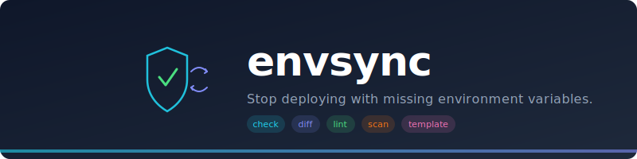
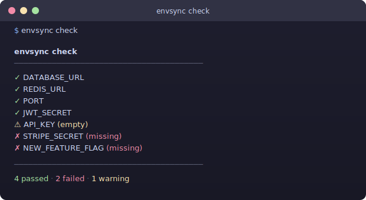
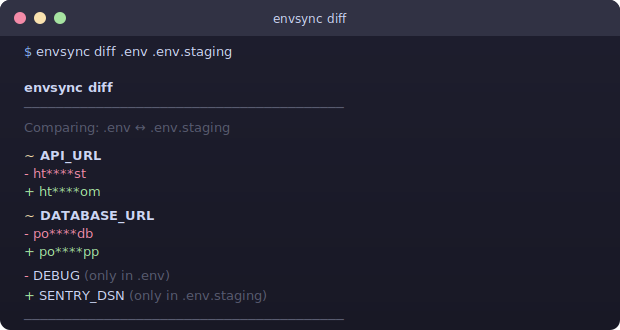
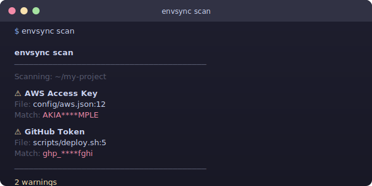

<p align="center">
  
</p>

<p align="center">
  <a href="https://www.npmjs.com/package/envsync-cli"></a>
  <a href="https://www.npmjs.com/package/envsync-cli"></a>
  <a href="https://github.com/semantic-innovations/envsync/actions/workflows/ci.yml"></a>
  <a href="https://github.com/semantic-innovations/envsync/blob/main/LICENSE"></a>
  
  
</p>

<p align="center">
  <b>Validate</b> &nbsp;·&nbsp; <b>Compare</b> &nbsp;·&nbsp; <b>Lint</b> &nbsp;·&nbsp; <b>Secure</b> &nbsp;·&nbsp; <b>Generate</b>
</p>

<p align="center">
  <a href="#-quick-start">Quick Start</a> &nbsp;&nbsp;|&nbsp;&nbsp; <a href="#-commands">Commands</a> &nbsp;&nbsp;|&nbsp;&nbsp; <a href="#-ci-integration">CI Setup</a> &nbsp;&nbsp;|&nbsp;&nbsp; <a href="#-contributing">Contribute</a>
</p>

---

<br/>

## The Problem

> Every developer has been here. **Every. Single. One.**

```
 App crashes       →  "DATABASE_URL is not defined"
 Deploy fails      →  Someone added a new env var, forgot to tell the team
 New teammate      →  Spends half a day asking "what env vars do I need?"
 Security panic    →  Someone committed .env to git
 Staging is weird  →  .env and .env.staging have different variables
```

Your `.env.example` says one thing. Your `.env` says another.
**Production says nothing — it just breaks.**

<br/>

## The Solution

**One tool. Five commands. Zero headaches.**

```bash
npm install -g envsync-cli
```

That's it. No config files. No setup. No dependencies to install.

<br/>

## Quick Start

```bash
envsync check       # Are all required env vars present?
envsync diff        # What's different between two env files?
envsync lint        # Any typos, duplicates, or bad formats?
envsync scan        # Did someone leak secrets in the code?
envsync template    # Generate .env.example automatically
```

Or run without installing:

```bash
npx envsync-cli check
```

<br/>

---

## Commands

### `envsync check`

**Validates your `.env` against `.env.example`** — instantly see what's missing, what's empty, and what's extra.

<p align="center">
  
</p>

```bash
envsync check                              # Auto-detects .env + .env.example
envsync check --env .env.local             # Check a specific env file
envsync check --example .env.template      # Use a specific example file
envsync check --ci                         # Exit code 1 on errors (for CI)
```

<br/>

### `envsync diff`

**Compares two env files side by side** — see what changed, what's missing, and what's extra. Values are **masked by default** so it's safe to share output.

<p align="center">
  
</p>

```bash
envsync diff .env .env.staging             # Compare two files
envsync diff .env .env.prod --show         # Show full values (unmasked)
envsync diff .env .env.prod --all          # Also show matching vars
```

<br/>

### `envsync scan`

**Scans your codebase for leaked secrets** — catches API keys, tokens, and credentials before they reach GitHub.

<p align="center">
  
</p>

<table>
<tr><td><b>Detects</b></td></tr>
<tr><td>

`AWS Access Keys` &nbsp; `GitHub Tokens` &nbsp; `GitLab Tokens` &nbsp; `Stripe Keys` &nbsp; `Slack Tokens` &nbsp; `Private Keys` &nbsp; `Bearer Tokens` &nbsp; `Basic Auth` &nbsp; `Generic Secrets`

</td></tr>
</table>

```bash
envsync scan                               # Scan current directory
envsync scan ./src                         # Scan specific directory
envsync scan --ci                          # Exit code 1 on findings
```

<br/>

### `envsync lint`

**Checks your `.env` for formatting issues** — catches invalid keys, duplicates, wrong types, and bad URLs before they cause silent bugs.

```
$ envsync lint

  envsync lint
  ────────────────────────────────────────
  ✗ Line 5: 123BAD
    Invalid key name (use A-Z, 0-9, _)
  ⚠ Line 8: PORT
    Value "abc" doesn't look like a port number
  ⚠ Line 12: DATABASE_URL
    Duplicate key (first defined on line 3)

  ────────────────────────────────────────
  9 passed · 1 failed · 2 warnings
```

```bash
envsync lint                               # Lint .env
envsync lint --env .env.production         # Lint a specific file
envsync lint --ci                          # Exit code 1 on errors
```

<br/>

### `envsync template`

**Generates `.env.example` from your `.env`** — strips all real values, preserves comments and structure. Never manually maintain `.env.example` again.

```
$ envsync template --dry-run

# Database
DATABASE_URL=
REDIS_URL=

# Server
PORT=
HOST=

# API Keys
API_KEY=
STRIPE_KEY=
```

```bash
envsync template                           # Generate .env.example
envsync template --output .env.sample      # Custom output name
envsync template --force                   # Overwrite existing
envsync template --dry-run                 # Preview without writing
```

<br/>

---

## CI Integration

### GitHub Actions

```yaml
# .github/workflows/env-check.yml
name: Env Check
on: [push, pull_request]

jobs:
  env-check:
    runs-on: ubuntu-latest
    steps:
      - uses: actions/checkout@v4
      - uses: actions/setup-node@v4
      - run: npx envsync-cli check --ci
      - run: npx envsync-cli scan --ci
```

### Pre-commit Hook

```json
{
  "scripts": {
    "prestart": "envsync check",
    "precommit": "envsync scan"
  }
}
```

Or with **[husky](https://github.com/typicode/husky)**:

```bash
npx husky add .husky/pre-commit "npx envsync-cli scan --ci"
```

### GitLab CI

```yaml
env-check:
  script:
    - npx envsync-cli check --ci
    - npx envsync-cli scan --ci
```

<br/>

---

## Use as a Library

```javascript
const { check, diff, lint, scan, template } = require('envsync-cli');

const result = check({ env: '.env', example: '.env.example' });
// { passed: 12, failed: 2, warnings: 1 }
```

<br/>

---

## Why envsync?

<table>
<thead>
<tr>
<th width="200">Problem</th>
<th width="250">Before</th>
<th width="250">After</th>
</tr>
</thead>
<tbody>
<tr>
<td><b>Missing env vars</b></td>
<td>App crashes at runtime</td>
<td><code>envsync check</code> catches it</td>
</tr>
<tr>
<td><b>New teammate</b></td>
<td>"Ask John for the env vars"</td>
<td><code>envsync check</code> shows what's missing</td>
</tr>
<tr>
<td><b>Staging vs prod</b></td>
<td>Manual comparison</td>
<td><code>envsync diff .env .env.prod</code></td>
</tr>
<tr>
<td><b>Leaked secrets</b></td>
<td>Found in code review (maybe)</td>
<td><code>envsync scan</code> catches instantly</td>
</tr>
<tr>
<td><b>Outdated .env.example</b></td>
<td>Always out of sync</td>
<td><code>envsync template</code> regenerates it</td>
</tr>
<tr>
<td><b>Bad formatting</b></td>
<td>Silent bugs</td>
<td><code>envsync lint</code> catches it</td>
</tr>
</tbody>
</table>

<br/>

---

## Key Features

<table>
<tr>
<td align="center" width="33%">
<br/>
<b>Zero Dependencies</b><br/>
<sub>Pure Node.js. Installs in seconds.<br/>No bloat. No supply chain risk.</sub>
<br/><br/>
</td>
<td align="center" width="33%">
<br/>
<b>Works Offline</b><br/>
<sub>Everything runs locally.<br/>Your env vars never leave your machine.</sub>
<br/><br/>
</td>
<td align="center" width="33%">
<br/>
<b>CI Ready</b><br/>
<sub>Use <code>--ci</code> flag for proper exit codes.<br/>Works with GitHub Actions, GitLab, etc.</sub>
<br/><br/>
</td>
</tr>
<tr>
<td align="center" width="33%">
<br/>
<b>Values Masked</b><br/>
<sub>Diff output masks secrets by default.<br/>Safe to share in logs and PRs.</sub>
<br/><br/>
</td>
<td align="center" width="33%">
<br/>
<b>Auto-Detection</b><br/>
<sub>Finds .env.example, .env.sample,<br/>.env.template automatically.</sub>
<br/><br/>
</td>
<td align="center" width="33%">
<br/>
<b>Fast</b><br/>
<sub>Runs in milliseconds.<br/>Won't slow down your workflow.</sub>
<br/><br/>
</td>
</tr>
</table>

<br/>

---

## Contributing

Contributions welcome! Each command is a standalone file in `src/commands/` — easy to understand, easy to extend.

```bash
git clone https://github.com/semantic-innovations/envsync.git
cd envsync
npm test
```

**Ideas for contributions:**

- New secret patterns for `scan`
- Additional lint rules
- YAML/TOML env file support
- VS Code extension
- Git hook installer command
- `envsync init` — interactive setup wizard

<br/>

## License

MIT - [LICENSE](LICENSE)

---

<p align="center">
  <sub>If your app has a <code>.env</code> file, it needs <code>envsync</code>.</sub>
  <br/>
  <sub>Built with care by <a href="https://github.com/semantic-innovations">Semantic Innovations</a></sub>
</p>
